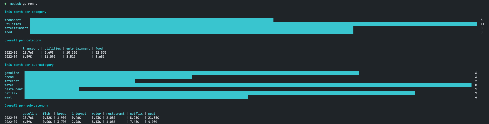

# mcduck

Simple tool to run computations on personal finance records. Input a csv, output
some nice charts.

## Output

## Terminal

The output is a user-friendly table and chart view of the data provided in the
CSV:



## Browser

In case you decide to leverage the web UI, spin up the server in `/cmd/service`
and access the UI under `localhost:8080`:


## Input

For an example input, check [example_input.csv](./example_input.csv). TLDR, the
format is:

```csv
date,amount,category,subcategory
2006-01-02;12.2;food;meat
...
```